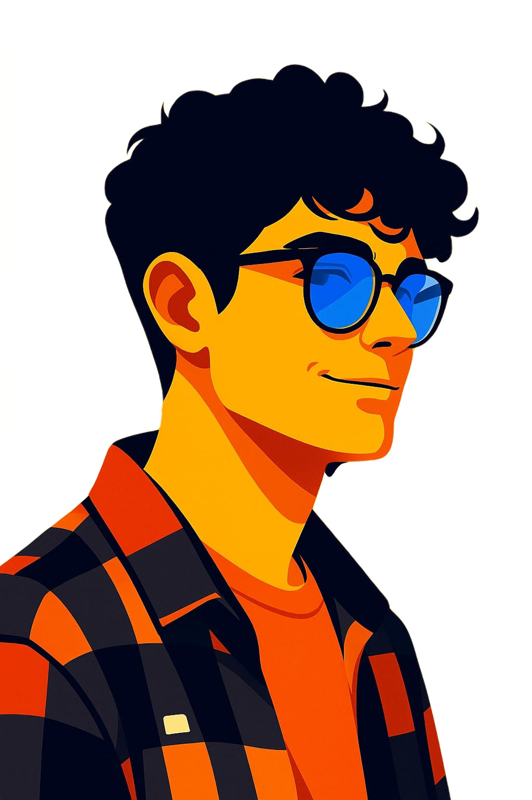

# Portfólio Ary.dev

<table>
  <tr>
    <td style="vertical-align: top; padding-right: 14px;">
      
    </td>
    <td style="vertical-align: down;">
      Portfólio pessoal <strong>elegante, responsivo e direto ao ponto</strong> para apresentar perfil, skills, projetos, formação e contatos.
    </td>
  </tr>
</table>

## Visão geral

Este projeto é um site de portfólio **one-page** (página única) com navegação por âncoras e seções bem definidas:

- Sobre mim
- Skills
- Trabalhos / Projetos
- Formação & Certificados
- Contato + Download de CV

---

## ✅ Funcionalidades

- **Layout responsivo** (desktop e mobile)
- **Navegação suave** entre seções (scroll smooth)
- **Modo Dark/Light** com persistência no `localStorage`
- **Botão “voltar ao topo”** com rolagem suave
- **Seção de projetos** com descrição e links (quando aplicável)
- **Download de CV** pronto para uso

---

## ✨ Tecnologias

- **HTML5**
- **Tailwind CSS (CDN)** para utilitários e responsividade
- **CSS customizado** (variáveis de tema e componentes)
- **JavaScript (Vanilla)** para interações (tema + scroll)
- **Lucide Icons** para ícones
- **Google Fonts** (Inter e M PLUS Rounded)

---

  

