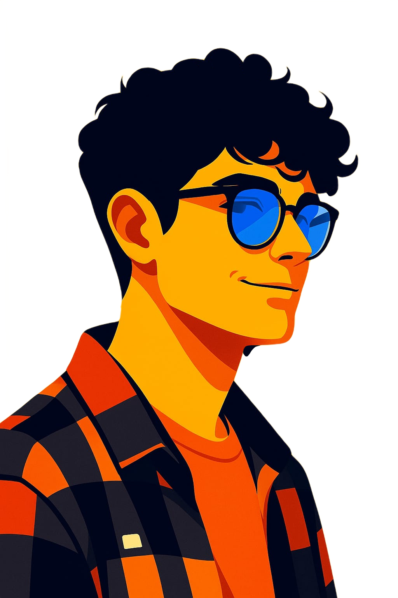

# Portfólio — Ary.dev

<table>
  <tr>
    <td style="vertical-align: top; padding-right: 14px;">
      
    </td>
    <td>
      Portfólio pessoal de <strong>Aryel S. Oliveira</strong> — desenvolvedor Flutter e Dart,
      atuando em aplicações multiplataforma integradas a APIs REST, em sistemas de produção.
      Página única, responsiva, sem framework e sem dependência de CDN além das fontes.
    </td>
  </tr>
</table>

## Seções

| # | Seção | O que mostra |
|---|-------|--------------|
| 01 | Sobre | Como trabalho: do front ao deploy, com a assinatura ao pé do texto |
| 02 | Plataformas | Diagrama SVG da arquitetura real + números que contam ao entrar na tela |
| 03 | O que eu trago | Proposta de valor concreta, antes da lista de tecnologias |
| 04 | Stack | Sete grupos, com destaque para o que é usado em produção |
| 05 | Trabalhos | DataRey em destaque + carrossel de projetos |
| 06 | Formação | Curso e certificados |
| 07 | Contato | E-mail, WhatsApp, LinkedIn, GitHub e download do currículo |

## Decisões técnicas

Este site é, ele mesmo, uma amostra de trabalho. As escolhas foram feitas pensando nisso:

- **Sem framework CSS.** O Tailwind era carregado via `cdn.tailwindcss.com`, que imprime um aviso
  de "não use em produção" no console. Para um portfólio de desenvolvedor, esse detalhe é lido.
  O CSS agora é próprio, com design tokens em `:root`.
- **Sem biblioteca de ícones.** Os ícones eram carregados do `unpkg.com/lucide@latest` — uma
  dependência externa não fixada, que pode mudar sozinha. Agora são um sprite SVG local.
- **Tema claro/escuro** por `data-theme` no `<body>`, com persistência em `localStorage`.
  Na primeira visita o site segue o `prefers-color-scheme` do sistema; todo acesso ao storage
  está protegido por `try/catch`, porque em janela anônima ele lança exceção em vez de retornar nulo.
- **Diagrama de arquitetura em SVG local.** Desenhado à mão, não é imagem: herda as cores do tema,
  tem `aria-label` descritivo e as linhas se desenham ao entrar na tela. O comprimento de cada traço
  é medido em runtime com `getTotalLength()` — chutar o `stroke-dasharray` faz a animação começar
  no lugar errado.
- **Assinatura como máscara, não como imagem.** O PNG tem canal alfa, então entra em
  `mask-image` com a cor vindo de `--gold`. Fica correta nos dois temas sem `filter: invert()`,
  que só funciona por acidente e erra a cor.
- **Movimento com propósito.** Marquee de tecnologias em dois sentidos (pausa no hover), contadores
  que animam uma única vez, carrossel com `scroll-snap`, e barra de progresso de rolagem em
  `requestAnimationFrame`. Tudo desligado sob `prefers-reduced-motion`.
- **Acessibilidade:** link de pular para o conteúdo, foco visível, rótulos nos ícones de navegação,
  carrossel navegável por teclado (setas) e `prefers-reduced-motion` respeitado.
- **SEO e compartilhamento:** `meta description`, Open Graph e JSON-LD (`schema.org/Person`),
  para que o link colado no LinkedIn ou WhatsApp gere um cartão com título, descrição e imagem.

## Estrutura

```
.
├── index.html      # marcação + sprite de ícones SVG
├── styles.css      # tokens de tema e todos os componentes
├── script.js       # tema, navegação ativa, reveal, voltar ao topo
└── assets/         # imagens, assinatura e currículo em PDF
```

## Rodar localmente

Basta abrir o `index.html` no navegador. Para servir por HTTP:

```bash
python -m http.server 8000
# depois abra http://localhost:8000
```

## Tecnologias

**HTML5** · **CSS3** (Grid, Flexbox, custom properties) · **JavaScript** (ES5+, sem dependências) ·
**SVG** · **Google Fonts** (Inter, M PLUS Rounded 1c, JetBrains Mono)

<p></p>

<p align="center">
  <a href="https://arycso.github.io/Portfolio/" target="_blank" rel="external">
      
    </a>
</p>
